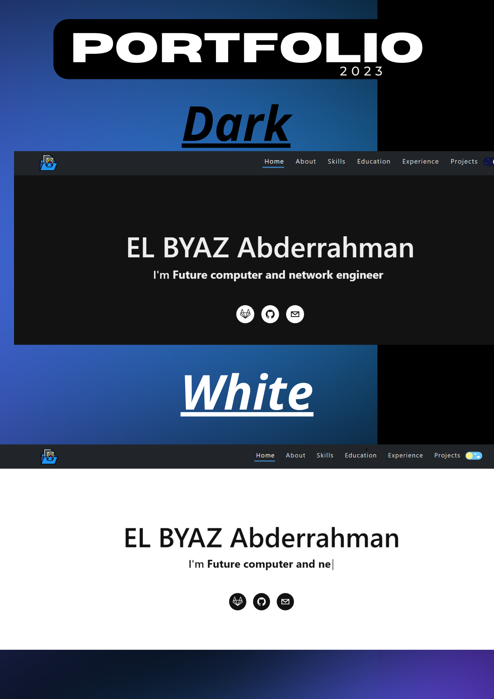
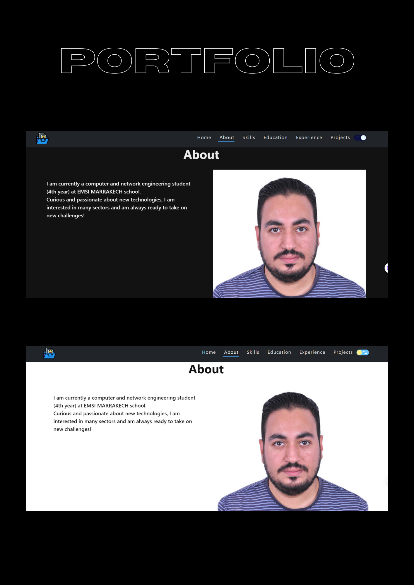
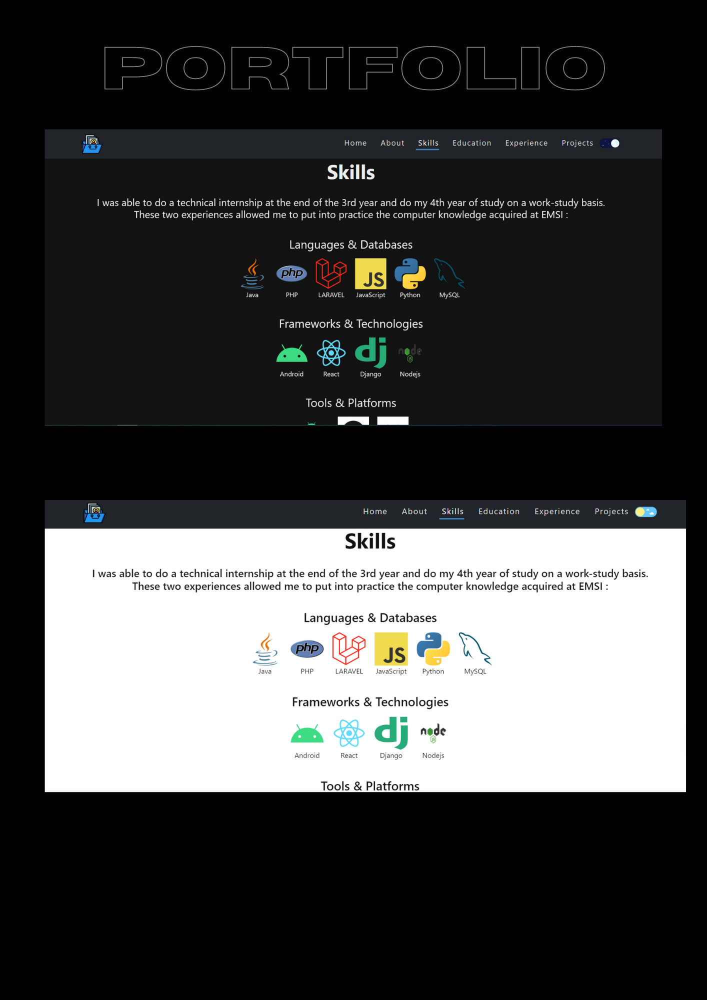
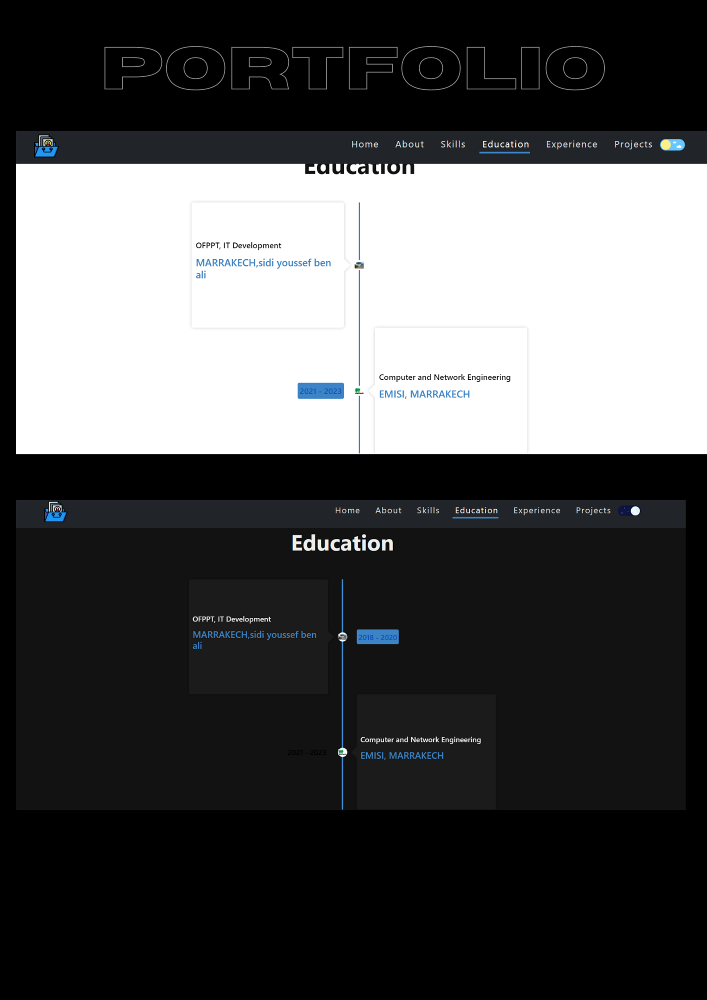
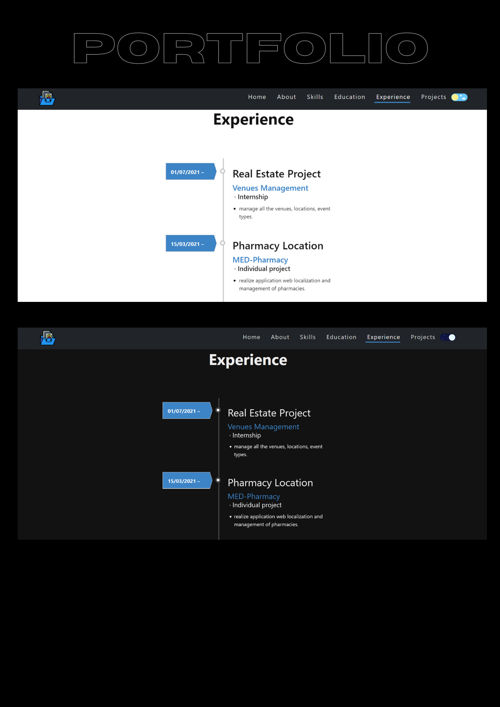
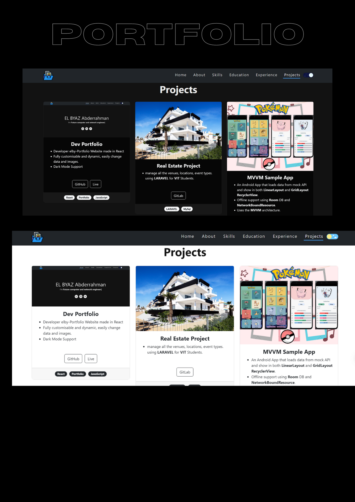

  <h1 align="center">Portfolio</h1>

<p align="center">
  This project refered from: <a href="https://github.com/isayyeah/elby-portfolio"</a>

</p>

## Demo
---
<p align="center">






</p>

---

## Getting Started 🚀
<p align="center">  
⚔️ These instructions will get you a copy of the project up and running on your local machine for development and testing purposes. See deployment for notes on how to deploy the project on a live system.
</p>
</br>


## Setup 🔧

From your command line, first clone Dev Portfolio:

```bash
# Clone the repository
$ git clone https://github.com/isayyeah/elby-portfolio

# Move into the repository
$ cd elby-portfolio

# Remove the current origin repository
$ git remote remove origin
```

After that, you can install the dependencies either using NPM or Yarn.

Using NPM: Simply run the below commands.

```bash
# Install dependencies
$ npm install --force

# Start the development server
$ npm start
```

Once your server has started, go to this url `http://localhost:3000/` to see the portfolio locally.
The page will reload if you make edits.

---


